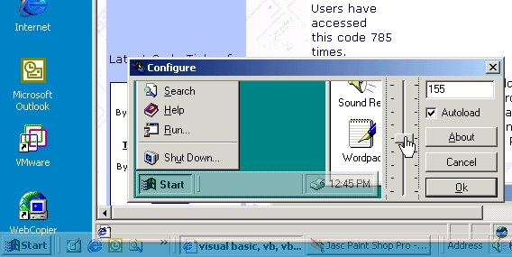



## RamoSoft Transparent Taskbar v1\.1 \(Improved\!\)

### Description

Are you bored from the task bar hidding the lower part of your apps? With this simple and small program you can make your windows taskbar transparent. It can be configured to load when OS starts and adjust the transparency level. ***PLEASE leave your COMMENTS and RATE IT!*** NOTE: It works just with Win2K.
 
### More Info
 

             |
---                |---
**Submitted On**   |2001-03-17 01:54:36
**By**             |[Leontti A\. Ramos M\.](https://github.com/Planet-Source-Code/PSCIndex/blob/master/ByAuthor/leontti-a-ramos-m.md)
**Level**          |Intermediate
**User Rating**    |5.0 (75 globes from 15 users)
**Compatibility**  |VB 5\.0, VB 6\.0
**Category**       |[Miscellaneous](https://github.com/Planet-Source-Code/PSCIndex/blob/master/ByCategory/miscellaneous__1-1.md)
**World**          |[Visual Basic](https://github.com/Planet-Source-Code/PSCIndex/blob/master/ByWorld/visual-basic.md)
**Archive File**   |[CODE\_UPLOAD171883172001\.zip](https://github.com/Planet-Source-Code/leontti-a-ramos-m-ramosoft-transparent-taskbar-v1-1-improved__1-21705/archive/master.zip)

